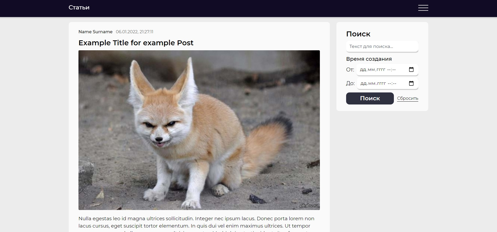

# Blog Web Application
___

## About
Blog Web Application built using ASP.NET API, _[React Client App](./ClientApp)_, PostgreSQL database for storing data and Entity Framework for database interactions.
#### Simplified global goals:
 * Posts system with possibility to create and view them;
 * Comments system with opportunities to comment any post and view comments for any post;
 * Accounts system that provide registration and authorization;
 * Marks system with opportunity to mark/unmark any post and comment;

## Current features
 - Creating new posts which include text data such as title and main content and graphic data such as image-cover;
 - Viewing existing posts separated into pages with filtration functionality;
 - Commenting posts in text-only form;
 - Marking, unmarking and changing mark for posts and comments with total mark representation;
 - Registration, token-based authorization with authomatic token refresh and logout on access errors, separation between authorized and non-authorized user accessible actitivies;
 - Viewing user personal data such as name or email and activities information such as posts/comments this user created/marked;

## TODO
 - Replies in comments;
 - Posts and comments constructor with patterns;
 - User data change;
 - Multi-language support
 - ...
